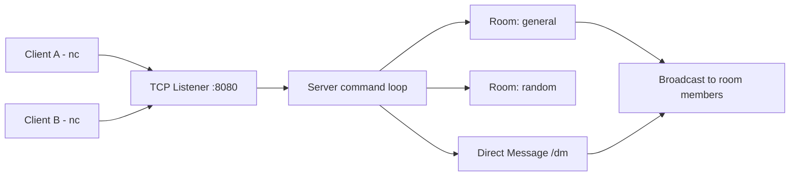

# Go TCP Chat

[](https://github.com/pouyasadri/go-tcp-chat/actions/workflows/ci.yml)


A lightweight TCP chat server written in Go. It supports multiple clients, room-based messaging, channel-driven command handling, and direct messages over raw TCP.

## Why this project

This project demonstrates:

- Concurrent network programming with Go (`net`, goroutines, channels)
- Event-loop style command handling in the server
- Room-based message broadcast model
- Direct messaging inside a room via `/dm`
- Defensive input handling and deterministic output behavior

## Tech stack

- Go 1.26
- Standard library only
- GitHub Actions for CI + GHCR image publishing

## Architecture



## Project structure

```text
.
├── .github/
│   └── workflows/
│       └── ci.yml
├── Dockerfile
├── cmd/
│   └── chat-server/
│       └── main.go
├── docs/
│   └── demo.gif
├── internal/
│   └── chat/
│       ├── client.go
│       ├── command.go
│       ├── command_test.go
│       ├── room.go
│       ├── server.go
│       └── server_test.go
├── go.mod
└── README.md
```

## Run locally

```bash
go run ./cmd/chat-server
```

Server listens on `:8080`.

## Run with Docker

Build locally:

```bash
docker build -t go-tcp-chat:local .
docker run --rm -p 8080:8080 go-tcp-chat:local
```

Pull from GHCR:

```bash
docker pull ghcr.io/pouyasadri/go-tcp-chat:latest
docker run --rm -p 8080:8080 ghcr.io/pouyasadri/go-tcp-chat:latest
```

## Try it with netcat

Open two terminals and connect both clients:

```bash
nc localhost 8080
```

Then use commands like:

- `/help` show available commands
- `/nick <name>` set your nickname
- `/join <room>` join or create a room
- `/rooms` list active rooms (sorted)
- `/msg <message>` send a message to current room
- `/dm <nick> <message>` send a direct message to a user in the same room
- `/quit` disconnect

## Notes on design

- The server owns room state and processes commands from clients through a channel.
- A client must join a room before sending messages.
- Direct messages only work for users in the same room.
- Empty rooms are cleaned up automatically when users leave.
- Unknown commands return an error plus help text to improve UX.

## Quality checks

Run all checks locally:

```bash
go test ./...
go vet ./...
```

## Next improvements

- Add graceful shutdown with context and OS signals
- Add connection deadlines and idle timeout handling
- Add integration tests for multi-client flows
